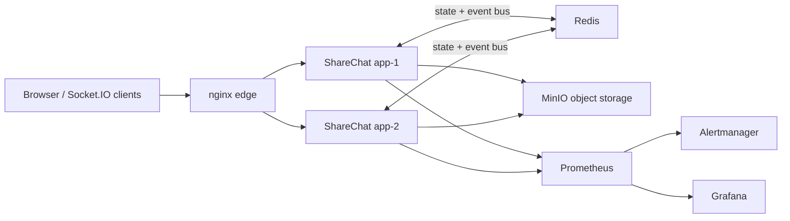

# ShareChat

ShareChat is the real-time and stateful systems showcase in the portfolio.
It is intentionally different from the microservice and webhook labs: this repo focuses on WebSocket delivery, multi-replica coordination, object storage uploads, rate limiting, and production-like runtime behavior behind an edge proxy.

## Why This Repo Exists

This project demonstrates:

- `nginx` as an edge proxy for long-lived WebSocket connections
- `2` application replicas behind one entrypoint
- `Redis` for shared state, rate limits, and cross-replica event fan-out
- `MinIO` as the demo object-storage backend for uploads
- metrics and alerts for real-time behavior
- smoke and compose-level validation for chat delivery and uploads

## Architecture



More detail: [docs/architecture.md](docs/architecture.md)

## Quick Demo Flow

```bash
npm ci
npm run build
node scripts/bootstrap-env.js
docker compose up -d --build
node scripts/compose-smoke.js
```

Key local endpoints:

- Edge: `http://127.0.0.1:18300`
- Replica 1: `http://127.0.0.1:18301`
- Replica 2: `http://127.0.0.1:18302`
- Prometheus: `http://127.0.0.1:19090`
- Alertmanager: `http://127.0.0.1:19093`
- Grafana: `http://127.0.0.1:13170`
- MinIO API: `http://127.0.0.1:19000`
- MinIO Console: `http://127.0.0.1:19001`

Grafana demo credentials:

- username: `admin`
- password: `admin12345`

## Validation

Application validation:

```bash
npm test
```

Compose/runtime validation:

```bash
docker compose config
docker compose up -d --build
node scripts/compose-smoke.js
node scripts/collect-logs.js
```

What the compose smoke proves:

- both app replicas are healthy
- chat messages propagate across replicas
- uploads pass through `nginx` and land in `MinIO`
- preview/download works through the edge
- `/api/metrics` exposes real application metrics
- Prometheus, Alertmanager, and Grafana are reachable

Evidence artifacts are collected to `artifacts/evidence/`.

## Runtime Behavior

The application exposes:

- `/api/health`
- `/api/ready`
- `/api/live`
- `/api/runtime`
- `/api/metrics`

Structured JSON logs are written to stdout, which keeps the local demo lightweight while still making logs easy to collect with `docker compose logs`.

## Important Environment Controls

Copy `.env.example` to `.env` and override only what you need.

Commonly used settings:

- `PUBLIC_ORIGIN`, `ALLOWED_ORIGINS`: browser origin control for HTTP and Socket.IO
- `REDIS_URL`: enables shared state and cross-replica event propagation
- `STORAGE_BACKEND`: `disk`, `s3`, or `minio`
- `STORAGE_S3_*`: S3/MinIO settings for object storage
- `MAX_UPLOAD_MB`, `MAX_UPLOAD_FILES`, `MAX_TOTAL_UPLOADS_MB`: upload safety limits
- `UPLOAD_RATE_LIMIT`, `DELETE_RATE_LIMIT`, `MESSAGE_RATE_LIMIT`: abuse controls
- `AUTH_INVITE_CODES`: optional protected mode
- `HTTPS_KEY_FILE`, `HTTPS_CERT_FILE`: app-level HTTPS outside the compose lab

## Runbook

Operator steps and troubleshooting live in [runbooks/demo.md](runbooks/demo.md)

## Portfolio Outcome

This repository now covers a non-duplicating niche in the portfolio:

- real-time delivery
- stateful scaling behavior
- WebSocket proxying
- object storage uploads
- replica coordination via Redis
- real operational smoke checks

## Known Limitations

These are deliberate scope boundaries, not current `DoD` blockers:

- no `mkcert` local TLS path yet for the compose lab
- no `Loki`/`Tempo` stack yet
- no image publishing, SBOM, or signing flow yet
- reconnect and rolling-restart drills can still be deepened

## Explicit Non-Goals

- add local TLS with `mkcert`
- add `Loki` for centralized logs
- add `Tempo` for request/event tracing
- add reconnect and rolling-restart drills
- add image publish + SBOM/signing to CI

The current repo is complete as a real-time workload showcase: WebSocket edge proxying, multi-replica state, Redis fan-out, MinIO uploads, metrics, alerts, smoke checks, and runbook.
